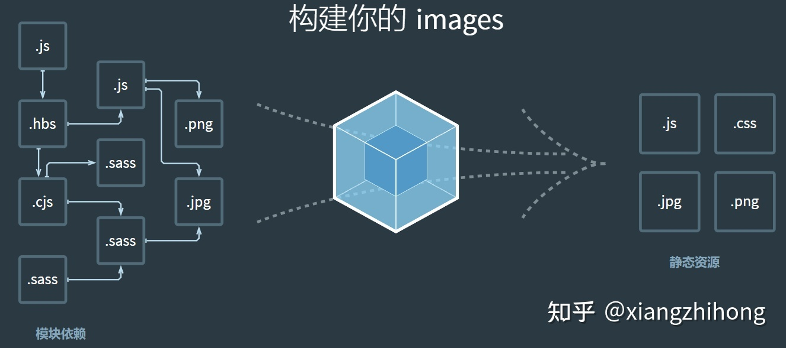
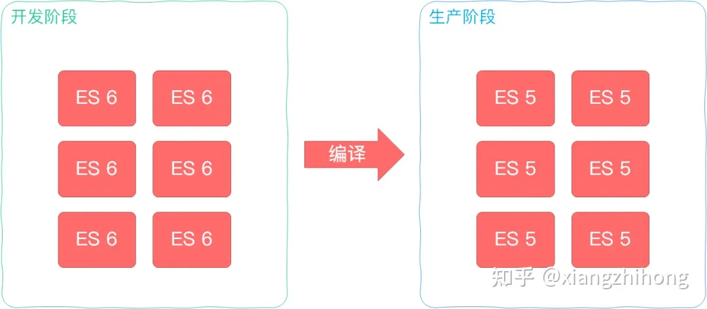

### webPack相关

#### 1.1 背景

Webpack 的目标是实现前端项目的**模块化**，从而更高效地管理和维护项目中的每一个资源。在早期的前端项目中，我们通过**文件划分**的形式来实现模块化，也就是将每个功能及其相关状态数据各自**单独放到不同的 JS 文件**中。约定每个文件是一个独立的模块，然后再将这些js文件引入到页面，一个script标签对应一个模块，然后再调用模块化的成员。比如：

```js
<script src="module-a.js"></script>
<script src="module-b.js"></script>
```

但这种模块化开发的弊端也十分明显，模块都是在全局中工作，大量模块成员**污染了环境**，模块与模块之间并没有依赖关系、维护困难、没有私有空间等问题。随后，就出现了命名空间方式，规定每个模块只暴露一个全局对象，然后模块的内容都挂载到这个对象中。

```js
window.moduleA = {
  method1: function () {
    console.log('moduleA#method1')
  }
}
```

不过，这种方式也没有解决第一种方式的**依赖**等问题。接着，有出现了使用**立即执行函数为模块提供私有空间**，通过参数的形式作为依赖声明。

```js
(function ($) {
  var name = 'module-a'

  function method1 () {
    console.log(name + '#method1')
    $('body').animate({ margin: '200px' })
  }

  window.moduleA = {
    method1: method1
  }
})(jQuery)
```

上述的方式早期解决模块的方式，但是仍然存在一些没有解决的问题。例如，我们是用过script标签在页面引入这些模块的，这些模块的加载并不受代码的控制，时间一久维护起来也十分的麻烦。

除了模块加载的问题以外，还需要规定模块化的规范，如今流行的则是CommonJS 、ES Modules。

特别是随着前端项目的越来越大，前端开发也变得十分的复杂，我们经常在开发过程中会遇到如下的问题：

- 需要通过模块化的方式来开发
- 使用一些高级的特性来加快我们的开发效率或者安全性，比如通过ES6+、TypeScript开发脚本逻辑，通过sass、less等方式来编写css样式代码
- 监听文件的变化来并且反映到浏览器上，提高开发的效率 - JavaScript 代码需要模块化，HTML 和 CSS 这些资源文件也会面临需要被模块化的问题
- 开发完成后我们还需要将代码进行压缩、合并以及其他相关的优化

而Webpack的出现，就是为了解决以上问题的。

总的来说，Webpack是一个模块打包工具，开发者可以很方面使用Webpack来管理模块依赖，并编译输出模块们所需要的静态文件。

#### 1.2 Webpack

Webpack 是一个用于现代JavaScript应用程序的静态模块打包工具，可以很方面的管理模块的恶依赖。

#### 1.2.1 静态模块

此处的静态模块指的是开发阶段，可以被 Webpack 直接引用的资源（可以直接被获取打包进bundle.js的资源）。当 Webpack 处理应用程序时，它会在内部构建一个依赖图，此依赖图对应映射到项目所需的每个模块（不再局限js文件），并生成一个或多个 bundle，如下图。



#### 1.2.2 Webpack作用
- 编译代码能力，提高效率，解决浏览器兼容问题
  


- 模块整合能力，提高性能，可维护性，解决浏览器频繁请求文件的问题


- 编译代码能力，提高效率，解决浏览器兼容问题
- 模块整合能力，提高性能，可维护性，解决浏览器频繁请求文件的问题
- 万物皆可模块能力，项目维护性增强，支持不同种类的前端模块类型，统一的模块化方案，所有资源文件的加载都可以通过代码控制。

### 二、说说webpack的构建流程

webpack 的运行流程是一个**串行**的过程，它的工作流程就是将各个插件串联起来。在运行过程中会**广播**事件，插件只需要**监听它所关心的事件**，就能加入到这条webpack机制中，去改变Webpack的运作。

从启动到结束会依次经历三大流程： 
- 初始化阶段：从配置文件和 Shell 语句中读取与合并参数，并初始化需要使用的插件和配置插件等执行环境所需要的参数。 
- 编译构建阶段：从 Entry 发出，针对每个 Module 串行调用对应的 Loader 去翻译文件内容，再找到该 Module 依赖的 Module，递归地进行编译处理。 
- 输出阶段：对编译后的 Module 组合成 Chunk，把 Chunk 转换成文件，输出到文件系统。

#### 2.1 初始化阶段
初始化阶段主要是从配置文件和 Shell 语句中读取与合并参数，得出最终的参数。配置文件默认下为webpack.config.js，也或者通过命令的形式指定配置文件，主要作用是用于激活webpack的加载项和插件。下面是webpack.config.js文件配置，内容分析如下注释：
```js
var path = require('path');
var node_modules = path.resolve(__dirname, 'node_modules');
var pathToReact = path.resolve(node_modules, 'react/dist/react.min.js');

module.exports = {
  // 入口文件，是模块构建的起点，同时每一个入口文件对应最后生成的一个 chunk。
  entry: './path/to/my/entry/file.js'，
  // 文件路径指向(可加快打包过程)。
  resolve: {
    alias: {
      'react': pathToReact
    }
  },
  // 生成文件，是模块构建的终点，包括输出文件与输出路径。
  output: {
    path: path.resolve(__dirname, 'build'),
    filename: '[name].js'
  },
  // 这里配置了处理各模块的 loader ，包括 css 预处理 loader ，es6 编译 loader，图片处理 loader。
  module: {
    loaders: [
      {
        test: /\.js$/,
        loader: 'babel',
        query: {
          presets: ['es2015', 'react']
        }
      }
    ],
    noParse: [pathToReact]
  },
  // webpack 各插件对象，在 webpack 的事件流中执行对应的方法。
  plugins: [
    new webpack.HotModuleReplacementPlugin()
  ]
};
```
webpack 将 webpack.config.js 中的各个配置项拷贝到 options 对象中，并加载用户配置的 plugins。完成上述步骤之后，则开始初始化Compiler编译对象，该对象掌控者webpack声明周期，不执行具体的任务，只是进行一些调度工作。

```js
class Compiler extends Tapable {
    constructor(context) {
        super();
        this.hooks = {
            beforeCompile: new AsyncSeriesHook(["params"]),
            compile: new SyncHook(["params"]),
            afterCompile: new AsyncSeriesHook(["compilation"]),
            make: new AsyncParallelHook(["compilation"]),
            entryOption: new SyncBailHook(["context", "entry"])
            // 定义了很多不同类型的钩子
        };
        // ...
    }
}
function webpack(options) {
  var compiler = new Compiler();
  ...// 检查options,若watch字段为true,则开启watch线程
  return compiler;
}
...
```
在上面的代码中，Compiler 对象继承自 Tapable，初始化时定义了很多钩子函数。
#### 2.2 编译构建
用上一步得到的参数初始化 Compiler 对象，加载所有配置的插件，执行对象的 run 方法开始执行编译。然后，根据配置中的 entry 找出所有的入口文件，如下。
```js
module.exports = {
  entry: './src/file.js'
}
```
初始化完成后会调用Compiler的run来真正启动webpack编译构建流程，主要流程如下：
- compile：开始编译
- make：从入口点分析模块及其依赖的模块，创建这些模块对象
- build-module：构建模块
- seal：封装构建结果
- emit：把各个chunk输出到结果文件
  
1. compile 编译
   
   执行了run方法后，首先会触发compile，主要是构建一个Compilation对象。该对象是编译阶段的主要执行者，主要会依次下述流程：执行模块创建、依赖收集、分块、打包等主要任务的对象。
2. make 编译模块
   当完成了上述的compilation对象后，就开始从Entry入口文件开始读取，主要执行_addModuleChain()函数，源码如下：
```js
_addModuleChain(context, dependency, onModule, callback) {
   ...
   // 根据依赖查找对应的工厂函数
   const Dep = /** @type {DepConstructor} */ (dependency.constructor);
   const moduleFactory = this.dependencyFactories.get(Dep);

   // 调用工厂函数NormalModuleFactory的create来生成一个空的NormalModule对象
   moduleFactory.create({
       dependencies: [dependency]
       ...
   }, (err, module) => {
       ...
       const afterBuild = () => {
        this.processModuleDependencies(module, err => {
         if (err) return callback(err);
         callback(null, module);
           });
    };

       this.buildModule(module, false, null, null, err => {
           ...
           afterBuild();
       })
   })
}

```
    _addModuleChain中接收参数dependency传入的入口依赖，使用对应的工厂函数NormalModuleFactory.create方法生成一个空的module对象。回调中会把此module存入compilation.modules对象和dependencies.module对象中，由于是入口文件，也会存入compilation.entries中。随后，执行buildModule进入真正的构建模块module内容的过程。

3. build module 完成模块编译
   这个过程的主要调用配置的loaders，将我们的模块转成标准的JS模块。在用 Loader 对一个模块转换完后，使用 acorn 解析转换后的内容，输出对应的抽象语法树（AST），以方便 Webpack 后面对代码的分析。

  从配置的入口模块开始，分析其 AST，当遇到require等导入其它模块语句时，便将其加入到依赖的模块列表，同时对新找出的依赖模块递归分析，最终搞清所有模块的依赖关系。

#### 2.3 输出阶段
seal方法主要是要生成chunks，对chunks进行一系列的优化操作，并生成要输出的代码。Webpack 中的 chunk ，可以理解为配置在 entry 中的模块，或者是动态引入的模块。

根据入口和模块之间的依赖关系，组装成一个个包含多个模块的 Chunk，再把每个 Chunk 转换成一个单独的文件加入到输出列表。在确定好输出内容后，根据配置确定输出的路径和文件名即可。

```js
output: {
    path: path.resolve(__dirname, 'build'),
        filename: '[name].js'
}
```
在 Compiler 开始生成文件前，钩子 emit 会被执行，这是我们修改最终文件的最后一个机会。

### 三、Webpack中常见的Loader
#### 3.1 Loader是什么
Loader本质就是一个**函数**，在该函数中对接收到的内容进行转换，**返回转换后的结果**。因为 **Webpack 只认识 JavaScript**，所以 Loader 就成了翻译官，对其他类型的**资源进行转译的预处理**工作。

默认情况下，在遇到import或者load加载模块的时候，webpack只支持对js文件打包。像css、sass、png等这些类型的文件的时候，webpack则无能为力，这时候就需要配置对应的loader进行文件内容的解析。在加载模块的时候，执行顺序.

关于配置Loader的方式，有常见的三种方式： 
- 配置方式（推荐）：在 webpack.config.js文件中指定 loader 
- 内联方式：在每个 import 语句中显式指定 loader 
- Cli 方式：在 shell 命令中指定它们

#### 3.1 配置方式
关于Loader的配置，我们通常是写在module.rules属性中，属性介绍如下： 
- rules是一个数组的形式，因此我们可以配置很多个loader。 
- 每一个loader对应一个对象的形式，对象属性test 为匹配的规则，一般情况为正则表达式。 
- 属性use针对匹配到文件类型，调用对应的 loader 进行处理。
  
下面是一个module.rules的示例代码：
```js
module.exports = {
  module: {
    rules: [
      {
        test: /\.css$/,
        use: [
          { loader: 'style-loader' },
          {
            loader: 'css-loader',
            options: {
              modules: true
            }
          },
          { loader: 'sass-loader' }
        ]
      }
    ]
  }
};
```

#### 3.2 Loader特性
从上述代码可以看到，在处理css模块的时候，use属性中配置了三个loader分别处理css文件。因为loader 支持链式调用，链中的每个loader会处理之前已处理过的资源，最终变为js代码。顺序为相反的顺序执行，即上述执行方式为sass-loader、css-loader、style-loader。

除此之外，loader的特性还有如下： 
- Loader 可以是同步的，也可以是异步的 
- Loader 运行在 Node.js 中，并且能够执行任何操作 - 除了常见的通过 package.json 的 main 来将一个 npm 模块导出为 loader，还可以在 module.rules 中使用 loader 字段直接引用一个模块 
- 插件(plugin)可以为 loader 带来更多特性 
- Loader 能够产生额外的任意文件

可以通过 loader 的预处理函数，为 JavaScript 生态系统提供更多能力。用户现在可以更加灵活地引入细粒度逻辑，例如：压缩、打包、语言翻译和更多其他特性。

#### 3.3 常用Loader
在页面开发过程中，除了需要导入一些场景js文件外，还需要配置响应的loader进行加载。WebPack常见的Loader如下： 
- style-loader：将css添加到DOM的内联样式标签style里，然后通过 dom 操作去加载 css。 
- css-loader :允许将css文件通过require的方式引入，并返回css代码。 
- less-loader: 处理less，将less代码转换成css。
- sass-loader: 处理sass，将scss/sass代码转换成css。 
- postcss-loader：用postcss来处理css。 
- autoprefixer-loader: 处理css3属性前缀，已被弃用，建议直接使用postcss。 
- file-loader: 分发文件到output目录并返回相对路径。 
- url-loader: 和file-loader类似，但是当文件小于设定的limit时可以返回一个Data Url。 
- html-minify-loader: 压缩HTML 
- babel-loader :用babel来转换ES6文件到ES。 
- awesome-typescript-loader：将 TypeScript 转换成 JavaScript，性能优于 ts-loader。 
- eslint-loader：通过 ESLint 检查 JavaScript 代码。 
- tslint-loader：通过 TSLint检查 TypeScript 代码。 
- cache-loader: 可以在一些性能开销较大的 Loader 之前添加，目的是将结果缓存到磁盘里

```js
rules: [
  ...,
 {
  test: /\.css$/,
    use: {
      loader: "css-loader",
      options: {
     // 启用/禁用 url() 处理
     url: true,
     // 启用/禁用 @import 处理
     import: true,
        // 启用/禁用 Sourcemap
        sourceMap: false
      }
    }
 }
]
```

### 四、Webpack中常见的Plugin
#### 4.1 基础
Plugin就是插件，基于事件流框架Tapable，插件可以扩展 Webpack 的功能，在 Webpack 运行的生命周期中会广播出许多事件，Plugin 可以监听这些事件，在合适的时机通过 Webpack 提供的 API 改变输出结果。

Webpack中的Plugin也是如此，Plugin赋予其各种灵活的功能，例如打包优化、资源管理、环境变量注入等，它们会运行在 Webpack 的不同阶段（钩子 / 生命周期），贯穿了Webpack整个编译周期。

使用的时候，通过配置文件导出对象中plugins属性传入new实例对象即可。

```js
const HtmlWebpackPlugin = require('html-webpack-plugin'); // 通过 npm 安装
const webpack = require('webpack'); // 访问内置的插件
module.exports = {
  ...
  plugins: [
    new webpack.ProgressPlugin(),
    new HtmlWebpackPlugin({ template: './src/index.html' }),
  ],
};
```
#### 4.2 特性
Plugin从本质上来说，就是一个具有apply方法Javascript对象。apply 方法会被 webpack compiler 调用，并且在整个编译生命周期都可以访问 compiler 对象。
```js
const pluginName = 'ConsoleLogOnBuildWebpackPlugin';

class ConsoleLogOnBuildWebpackPlugin {
  apply(compiler) {
    compiler.hooks.run.tap(pluginName, (compilation) => {
      console.log('webpack 构建过程开始！');
    });
  }
}

module.exports = ConsoleLogOnBuildWebpackPlugin;
```
我们可以使用上面的方式，来获取Plugin在编译生命周期钩子。如下： 
- entry-option ：初始化 option 
- compile： 真正开始的编译，在创建 compilation 对象之前 
- compilation ：生成好了 compilation 对象 
- make：从 entry 开始递归分析依赖，准备对每个模块进行 build 
- after-compile： 编译 build 过程结束 
- emit ：在将内存中 assets 内容写到磁盘文件夹之前
- after-emit ：在将内存中 assets 内容写到磁盘文件夹之后 
- done： 完成所有的编译过程 
- failed： 编译失败的时候

#### 4.3 常见的Plugin
Weebpack中，常见的plugin有如下一些： 
- define-plugin：定义环境变量 (Webpack4 之后指定 mode 会自动配置) 
- ignore-plugin：忽略部分文件 
- html-webpack-plugin：简化 HTML 文件创建 (依赖于 html-loader) 
- web-webpack-plugin：可方便地为单页应用输出 HTML，比 html-webpack-plugin 好用 
- uglifyjs-webpack-plugin：不支持 ES6 压缩 (Webpack4 以前) 
- terser-webpack-plugin: 支持压缩 ES6 (Webpack4) 
- webpack-parallel-uglify-plugin: 多进程执行代码压缩，提升构建速度 
- mini-css-extract-plugin: 分离样式文件，CSS 提取为独立文件，支持按需加载 (替代extract-text-webpack-plugin) 
- serviceworker-webpack-plugin：为网页应用增加离线缓存功能 
- clean-webpack-plugin: 目录清理 
- ModuleConcatenationPlugin: 开启 Scope Hoisting 
- speed-measure-webpack-plugin: 可以看到每个 Loader 和 Plugin 执行耗时 (整个打包耗时、每个 Plugin 和 Loader 耗时) 
- webpack-bundle-analyzer: 可视化 Webpack 输出文件的体积 (业务组件、依赖第三方模块)


```js
const {CleanWebpackPlugin} = require('clean-webpack-plugin');
module.exports = {
 ...
  plugins: [
    ...,
    new CleanWebpackPlugin(),
    ...
  ]
}
```

### 五、Loader和Plugin的区别，以及如何自定义Loader和Plugin
#### 5.1 区别
Loader本质就是一个函数，在该函数中对接收到的内容进行转换，返回转换后的结果。因为 Webpack 只认识 JavaScript，所以 Loader 就成了翻译官，对其他类型的资源进行转译的预处理工作。

Plugin就是插件，基于事件流框架Tapable，插件可以扩展 Webpack 的功能，在 Webpack 运行的生命周期中会广播出许多事件，Plugin 可以监听这些事件，在合适的时机通过 Webpack 提供的 API 改变输出结果。

- Loader **运行在打包文件之前**，Loader在 module.rules 中配置，作为模块的解析规则，类型为数组。每一项都是一个 Object，内部包含了 test(类型文件)、loader、options (参数)等属性。
- Plugins 在整个编译周期都起作用，Plugin在 plugins 中单独配置，类型为数组，每一项是一个 Plugin 的实例，参数都通过构造函数传入。

#### 5.2 自定义Loader
我们知道，Loader本质上来说就是一个函数，函数中的 **this 作为上下文**会被 webpack 填充，因此我们不能将 loader设为一个箭头函数。该函数接受一个参数，为 webpack 传递给 loader 的文件源内容。

同时，函数中 this 是由 webpack 提供的对象，能够获取当前 loader 所需要的各种信息。函数中有异步操作或同步操作，异步操作通过 this.callback 返回，返回值要求为 string 或者 Buffer，如下。

```js
// 导出一个函数，source为webpack传递给loader的文件源内容
module.exports = function(source) {
    const content = doSomeThing2JsString(source);

    // 如果 loader 配置了 options 对象，那么this.query将指向 options
    const options = this.query;

    // 可以用作解析其他模块路径的上下文
    console.log('this.context');

    /*
     * this.callback 参数：
     * error：Error | null，当 loader 出错时向外抛出一个 error
     * content：String | Buffer，经过 loader 编译后需要导出的内容
     * sourceMap：为方便调试生成的编译后内容的 source map
     * ast：本次编译生成的 AST 静态语法树，之后执行的 loader 可以直接使用这个 AST，进而省去重复生成 AST 的过程
     */
    this.callback(null, content); // 异步
    return content; // 同步
}
```
#### 5.3 自定义Plugin
Webpack的Plugin是基于事件流框架Tapable，由于webpack基于**发布订阅模式**，在运行的生命周期中会广播出许多事件，插件通过监听这些事件，就可以在特定的阶段执行自己的插件任务。

同时，Webpack编译会创建两个核心对象：compiler和compilation。

- compiler：包含了 Webpack 环境的所有的配置信息，包括 options，loader 和 plugin，和 webpack 整个生命周期相关的钩子.
- compilation：作为 Plugin 内置事件回调函数的参数，包含了当前的模块资源、编译生成资源、变化的文件以及被跟踪依赖的状态信息。当检测到一个文件变化，一次新的 Compilation 将被创建。

如果需要自定义Plugin，也需要遵循一定的规范： - 插件必须是一个函数或者是一个包含 apply 方法的对象，这样才能访问compiler实例 - 传给每个插件的 compiler 和 compilation 对象都是同一个引用，因此不建议修改 - 异步的事件需要在插件处理完任务时调用回调函数通知 Webpack 进入下一个流程，不然会卡住

下面是一个自定Plugin的模板：
```js
class MyPlugin {
    // Webpack 会调用 MyPlugin 实例的 apply 方法给插件实例传入 compiler 对象
  apply (compiler) {
    // 找到合适的事件钩子，实现自己的插件功能
    compiler.hooks.emit.tap('MyPlugin', compilation => {
        // compilation: 当前打包构建流程的上下文
        console.log(compilation);

        // do something...
    })
  }
}
```
在 emit 事件被触发后，代表源文件的转换和组装已经完成，可以读取到最终将输出的资源、代码块、模块及其依赖，并且可以修改输出资源的内容。

### 六、Webpack 热更新
#### 6.1 热更新
Webpack的热更新又称热替换（Hot Module Replacement），缩写为HMR。这个机制可以做到不用刷新浏览器而将新变更的模块替换掉旧的模块。

HMR的核心就是**客户端从服务端拉去更新后的文件**，准确的说是 chunk diff (chunk 需要更新的部分)，实际上 WDS 与浏览器之间维护了一个**Websocket**，当本地资源发生变化时，WDS 会向浏览器推送更新，并带上**构建时的 hash**，让**客户端与上一次资源进行对比**。客户端对比出差异后会向**WDS 发起Ajax请求来获取更改内容**(文件列表、hash)，这样客户端就可以再借助这些信息继续向 WDS 发起jsonp请求获取该chunk的增量更新。

在Webpack中配置开启热模块也非常的简单，只需要添加如下代码即可。

```js
const webpack = require('webpack')
module.exports = {
  // ...
  devServer: {
    // 开启 HMR 特性
    hot: true
    // hotOnly: true
  }
}
```

需要说明的是，实现热更新还需要去指定哪些模块发生更新时进行HRM，因为默认情况下，HRM只对css文件有效。

```js

if(module.hot){
    module.hot.accept('./util.js',()=>{
        console.log("util.js更新了")
    })
}

```
### 七、Webpack Proxy工作原理
#### 7.1 代理
在项目开发中不可避免会遇到跨越问题，Webpack中的Proxy就是解决前端跨域的方法之一。所谓代理，指的是在**接收客户端发送的请求**后**转发给其他服务器**的行为，webpack中提供服务器的工具为webpack-dev-server。

#### 7.1.1 webpack-dev-server
webpack-dev-server是 webpack 官方推出的一款开发工具，将自动编译和自动刷新浏览器等一系列对开发友好的功能全部集成在了一起。同时，为了提高开发者日常的开发效率，只适用在开发阶段。在webpack配置对象属性中配置代理的代码如下：
```js
// ./webpack.config.js
const path = require('path')

module.exports = {
    // ...
    devServer: {
        contentBase: path.join(__dirname, 'dist'),
        compress: true,
        port: 9000,
        proxy: {
            '/api': {
                target: 'https://api.github.com'
            }
        }
        // ...
    }
```

其中，devServetr里面proxy则是关于代理的配置，该属性为对象的形式，对象中每一个属性就是一个代理的规则匹配

属性的名称是需要被代理的请求路径前缀，一般为了辨别都会设置前缀为 /api，值为对应的代理匹配规则，对应如下：
- target：表示的是代理到的目标地址。 
- pathRewrite：默认情况下，我们的 /api-hy 也会被写入到URL中，如果希望删除，可以使用pathRewrite。 
- secure：默认情况下不接收转发到https的服务器上，如果希望支持，可以设置为false。 
- changeOrigin：它表示是否更新代理后请求的 headers 中host地址。


### 八、如何借助Webpack来优化性能
作为一个项目的打包构建工具，在完成项目开发后经常需要利用Webpack对前端项目进行性能优化，常见的优化手段有如下几个方面：
#### JS代码压缩
  > terser是一个JavaScript的解释、绞肉机、压缩机的工具集，可以帮助我们压缩、丑化我们的代码，让bundle更小。在production模式下，webpack 默认就是使用 TerserPlugin 来处理我们的代码的。如果想要自定义配置它，配置方法如下。

```js
const TerserPlugin = require('terser-webpack-plugin')
module.exports = {
    ...
    optimization: {
        minimize: true,
        minimizer: [
            new TerserPlugin({
                parallel: true              // 电脑cpu核数-1
            })
        ]
    }
}
```
TerserPlugin常用的属性如下： 
- extractComments：默认值为true，表示会将注释抽取到一个单独的文件中，开发阶段，我们可设置为 false ，不保留注释 
- parallel：使用多进程并发运行提高构建的速度，默认值是true，并发运行的默认数量： os.cpus().length - 1
- terserOptions：设置我们的terser相关的配置： compress：设置压缩相关的选项，mangle：设置丑化相关的选项，可以直接设置为true mangle：设置丑化相关的选项，可以直接设置为true toplevel：底层变量是否进行转换 keep_classnames：保留类的名称 keep_fnames：保留函数的名称.
  
#### CSS代码压缩
> CSS压缩通常用于去除无用的空格等，不过因为很难去修改选择器、属性的名称、值等，所以我们可以使用另外一个插件：css-minimizer-webpack-plugin。配置如下：

```js
const CssMinimizerPlugin = require('css-minimizer-webpack-plugin')
module.exports = {
    // ...
    optimization: {
        minimize: true,
        minimizer: [
            new CssMinimizerPlugin({
                parallel: true
            })
        ]
    }
}
```
#### Html文件代码压缩
使用HtmlWebpackPlugin插件来生成HTML的模板时候，可以通过配置属性minify进行html优化，配置如下。
```js
module.exports = {
    ...
    plugin:[
        new HtmlwebpackPlugin({
            ...
            minify:{
                minifyCSS:false, // 是否压缩css
                collapseWhitespace:false, // 是否折叠空格
                removeComments:true // 是否移除注释
            }
        })
    ]
}
```

#### 文件大小压缩
对文件的大小进行压缩，可以有效减少http传输过程中宽带的损耗，文件压缩需要用到 compression-webpack-plugin插件，配置如下。
```js
new ComepressionPlugin({
    test:/\.(css|js)$/,  // 哪些文件需要压缩
    threshold:500, // 设置文件多大开始压缩
    minRatio:0.7, // 至少压缩的比例
    algorithm:"gzip", // 采用的压缩算法
})
```
#### 图片压缩
如果我们对bundle包进行分析，会发现图片等多媒体文件的大小是远远要比 js、css 文件要大的，所以图片压缩在打包方面也是很重要的。配置可以参考如下的方式：
```js
module: {
  rules: [
    {
      test: /\.(png|jpg|gif)$/,
      use: [
        {
          loader: 'file-loader',
          options: {
            name: '[name]_[hash].[ext]',
            outputPath: 'images/',
          }
        },
        {
          loader: 'image-webpack-loader',
          options: {
            // 压缩 jpeg 的配置
            mozjpeg: {
              progressive: true,
              quality: 65
            },
            // 使用 imagemin**-optipng 压缩 png，enable: false 为关闭
            optipng: {
              enabled: false,
            },
            // 使用 imagemin-pngquant 压缩 png
            pngquant: {
              quality: '65-90',
              speed: 4
            },
            // 压缩 gif 的配置
            gifsicle: {
              interlaced: false,
            },
            // 开启 webp，会把 jpg 和 png 图片压缩为 webp 格式
            webp: {
              quality: 75
            }
          }
        }
      ]
    },
  ]
}
```
#### Tree Shaking
Tree Shaking 是一个术语，在计算机中表示**消除死代码**，**依赖于ES Module的静态语法分析**。在webpack实现Tree shaking有两种不同的方案： 
- usedExports：通过标记某些函数是否被使用，之后通过Terser来进行优化的 
- sideEffects：跳过整个模块/文件，直接查看该文件是否有副作用.

```js
module.exports = {
    ...
    optimization:{
        usedExports
    }
}
```
而sideEffects则用于告知webpack compiler在编译时哪些模块有副作用，配置方法是在package.json中设置sideEffects属性。如果sideEffects设置为false，就是告知webpack可以安全的删除未用到的exports，如果有些文件需要保留，可以设置为数组的形式。

```js
"sideEffecis":[    "./src/util/format.js",    "*.css" // 所有的css文件]
```

#### 8.7 代码分离
默认情况下，所有的JavaScript代码（业务代码、第三方依赖、暂时没有用到的模块）在首页全部都加载，就会影响首页的加载速度。如果可以分出出更小的bundle，以及控制资源加载优先级，从而优化加载性能。

代码分离可以通过**splitChunksPlugin**来实现，该插件webpack已经默认安装和集成，只需要配置即可。

```js
module.exports = {   
 ...    
    optimization:{    
        splitChunks:{       
             chunks:"all"     
                }  
        }}
```

splitChunks有如下几个属性： 
- Chunks：对同步代码还是异步代码进行处理 
- minSize： 拆分包的大小, 至少为minSize，如何包的大小不超过minSize，这个包不会拆分 
- maxSize： 将大于maxSize的包，拆分为不小于minSize的包 
- minChunks：被引入的次数，默认是1


总结一下，Webpack对前端性能的优化，主要是通过文件体积大小入手，主要的措施有分包、减少Http请求次数等。


usedExports的配置方法很简单，只需要将usedExports设为true即可，如下。
- 代码分离
- 内联 chunk


### 九、提高Webpack的构建速度
随着功能和业务代码越来越多，相应的 Webpack 的构建时间也会越来越久，构建的效率也会越来越低，那如何提升Webpack 构建速度，是前端工程化的重要一环。常用的手段有如下一些： 
- 优化 loader 配置 
- 合理使用 resolve.extensions 
- 优化 resolve.modules 
- 优化 resolve.alias 
- 使用 DLLPlugin 插件 
- 使用 cache-loader 
- terser 启动多线程 
- 合理使用 sourceMap

### 十、 除了Webpack外，你还了解哪些模块管理工具
模块化是一种处理复杂系统分解为更好的可管理模块的方式。可以用来分割、组织和打包应用。每个模块完成一个特定的子功能，所有的模块按某种方法组装起来，成为一个整体。

在前端领域中，除了Webpack外，比较流行的模块打包工具还包括Rollup、Parcel、snowpack和最近风靡的Vite。

#### 10.1 Rollup
Rollup 是一款 ES Modules 打包器，可以将小块代码编译成大块复杂的代码，例如 library 或应用程序。从作用上来看，Rollup 与 Webpack 非常类似。不过相比于 Webpack，Rollup 要小巧的多。现在很多苦都使用它进行打包，比如：Vue、React和three.js等。

使用之前，可以使用npm install --global rollup 命令进行安装。Rollup 可以通过命令行接口(command line interface)配合可选配置文件(optional configuration file)来调用，或者可以通过 JavaScript API来调用。运行 rollup --help 可以查看可用的选项和参数。

#### 10.2 Parcel
Parcel ，是一款完全零配置的前端打包器，它提供了 “傻瓜式” 的使用体验，只需了解简单的命令，就能构建前端应用程序。

使用Parcel的流程如下


1. 创建目录并使用npm init -y初始化package.json，
2. 安装模块npm i parcel-bundler --save-dev
3. 创建src/index.html文件作为入口文件，虽然Parcel支持任意文件为打包入口，但是还是推荐我们使用HTML文件作为打包入口，官方理由是HTML是浏览器运行的入口，故应该使用HTML作为打包入口。

使用之前，需要在package.json中配置脚本


#### 10.3 Vite
Vite是Vue的作者尤雨溪开发的Web开发构建工具，它是一个基于浏览器原生ES模块导入的开发服务器，在开发环境下，利用浏览器去解析import，在服务器端按需编译返回，完全跳过了打包这个概念，服务器随启随用。同时不仅对Vue文件提供了支持，还支持热更新，而且热更新的速度不会随着模块增多而变慢。

Vite具有以下特点： 
- 快速的冷启动 
- 即时热模块更新（HMR，Hot Module Replacement） - 真正按需编译

Vite由两部分组成： 
- 一个开发服务器，它基于 原生 ES 模块 提供了丰富的内建功能，如速度快到惊人的 [模块热更新HMR。 
- 一套构建指令，它使用 Rollup打包你的代码，并且它是预配置的，可以输出用于生产环境的优化过的静态资源。

Vite在开发阶段可以直接启动开发服务器，不需要进行打包操作，也就意味着不需要分析模块的依赖、不需要编译，因此启动速度非常快。当浏览器请求某个模块的时候，根据需要对模块的内容进行编译，大大缩短了编译时间。

在热模块HMR方面，当修改一个模块的时候，仅需让浏览器重新请求该模块即可，无须像Webpack那样需要把该模块的相关依赖模块全部编译一次，因此效率也更高。


  
